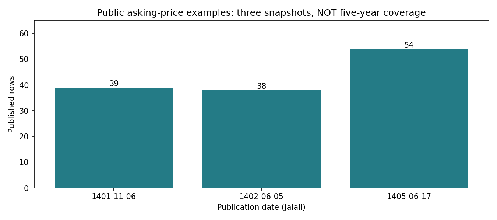

# Tehran House Price — ML Engineering & Data Quality

[](https://github.com/Captain-Jorf/tehran-house-price/actions/workflows/ci.yml)
[](https://github.com/Captain-Jorf/tehran-house-price/actions/workflows/docker.yml)
[](pyproject.toml)
[](pyproject.toml)

An end-to-end Tehran housing ML project combining a property-price serving pipeline with **auditable data collection, temporal backtesting, and explicit data-quality controls**.

این پروژه مهندسی یادگیری ماشین را از ورود و اعتبارسنجی داده تا آموزش، API، پایش و استقرار پوشش می‌دهد. بخش پژوهشی جدید، داده‌های واقعیِ منتشرشده را با منبع و محدودیت‌های مشخص بررسی می‌کند؛ هدف، ارائهٔ نتیجهٔ قابل‌بازتولید است، نه ادعای دقت بدون شواهد.

> **Current status — 2026-09-12:** latest full local test run: **239 passed · 10 skipped · 82% coverage**. Recent data collection remains partial. The monthly backtests below do **not** validate the individual-property API or establish five-year forecasting accuracy.

## Contents

- [Engineering highlights](#engineering-highlights)
- [Data and provenance](#data-and-provenance)
- [Measured results](#measured-results)
- [Architecture](#architecture)
- [Quick start](#quick-start)
- [API](#api)
- [Testing and reproducibility](#testing-and-reproducibility)
- [Deployment and monitoring](#deployment-and-monitoring)
- [Limitations and roadmap](#limitations-and-roadmap)
- [Project structure](#project-structure)

## Engineering highlights

| Capability | Implementation / evidence |
|---|---|
| Data pipeline | Ingestion, cleaning, Pandera validation and dataset construction |
| ML workflow | scikit-learn-compatible features, baselines, XGBoost, MLflow tracking and registry |
| Model serving | FastAPI, validated request schemas, single and batch inference |
| Operational tooling | Docker, GitHub Actions, Render configuration, Prometheus and structured logs |
| Reproducible research | Pinned factual extracts, checksums, source-level attribution and offline report generation |
| Honest evaluation | Calendar-aware backtests, validation-based model selection, no pooling of incompatible indicators |
| Automated checks | Unit and integration tests; [latest full execution log](docs/reports/tehran_listing_archive/full-tests.txt) |

**Portfolio focus:** building and testing an ML system while identifying where the available data cannot support a model claim. Operational availability, current-market accuracy and research completeness are separate questions.

## Data and provenance

The repository contains **separate datasets for separate tasks**. Their row counts must not be added together as if they were a single training set.

| Dataset | Coverage | Size | Appropriate use |
|---|---|---:|---|
| Recent CBI-secondary transaction means | Collected months within 1400/06–1405/05 | 31 monthly observations | Retrospective aggregate-price backtesting |
| Kilid published listing indicator | 1404/06–1405/05 | 12 monthly observations | Separate platform-indicator backtesting |
| Public newspaper asking-price examples | 1401/11/06, 1402/06/05, 1405/06/17 | 131 rows | Data curation and feature-quality checks; not yet used to retrain the API |
| Historical secondary city series | 1395–1399 | 60 monthly observations | Historical research only; not the latest five years |
| Existing property-model pipeline | Legacy Kaggle housing dataset | See training documentation | Individual-property model workflow; separate from these research extracts |

### Latest-five-year coverage

The target is the **60 completed Jalali months from 1400/06 through 1405/05**, as of September 12, 2026. The current incomplete month, 1405/06, is excluded from this monthly window.

There are 43 collected monthly observations across two **incompatible** measures. **17 months have neither measure.** This is not a complete, homogeneous five-year dataset. Missing prices are not imputed or reconstructed from reported percentage changes.


[Recent-period report](docs/reports/tehran_recent/README.md) · [Observations with sources](docs/reports/tehran_recent/observations.csv) · [Coverage ledger](docs/reports/tehran_recent/coverage.csv) · [Collection log](docs/reports/tehran_recent/collection-log.md)

### Property-level asking-price archive

The additional 131 rows are transcribed from public newspaper tables republished by IranJib / Donya-e-Eqtesad:

| Publication date (Jalali) | Rows | Scope |
|---|---:|---|
| 1401/11/06 | 39 | Selected Tehran properties |
| 1402/06/05 | 38 | Selected Tehran properties |
| 1405/06/17 | 54 | Districts 8, 13 and 14; building ages 10–25 |

Each row retains the source URL, source row number, publication date, reported location, area, raw building age and asking price. **“New-build” is preserved as a label rather than assigned an invented numeric age.** No contact details are collected.



These are published asking-price examples, **not verified transactions or independently verified unique properties**. Three snapshots are not five-year coverage. The latest sample has a different geographic composition, so connecting sample means would not establish a citywide price trend.

[Archive report and caveats](docs/reports/tehran_listing_archive/README.md) · [CSV](data/external/tehran_listing_archive/listings.csv) · [Source manifest](data/external/tehran_listing_archive/manifest.json)

## Measured results

### Retrospective monthly backtests

Each series is evaluated independently. The protocol uses six observations for warmup, selects among persistence, calendar drift and a six-observation log trend on **validation MAE**, and then reports held-out test performance. Predictions require the immediately preceding calendar month; gaps are not treated as adjacent observations.

| Series | Test targets | Selected model | Selected MAPE | Last-month baseline MAPE |
|---|---:|---|---:|---:|
| CBI-secondary transaction mean | 13 eligible months | Calendar drift | 2.08% | **1.62%** |
| Kilid listing indicator | 3 months, 1405/03–1405/05 | Calendar drift | **3.72%** | 8.31% |

**The selected model loses to persistence on the transaction series.** That result is retained rather than choosing the test winner after seeing the test data. The Kilid test contains only three targets and is too small for a broad accuracy claim.

These are final-vintage, retrospective backtests: publication delays and revisions are not fully controlled. The evaluation design was not preregistered. These percentages are **not errors for predicting an individual apartment's price**.


[Detailed protocol, metrics and caveats](docs/reports/tehran_recent/README.md)

### Historical reference — not recent-market validation

The separate 1395–1399 city series contains 60 observations. Its 1399 rolling test reports **4.88% MAPE** for drift versus **5.82%** for last-month persistence. The secondary source's units have not been independently verified. This result neither substitutes for the latest five years nor validates the property API.

[Historical report and charts](docs/reports/tehran_monthly/README.md)

## Architecture

```text
Property-model workflow
  Ingest → Clean → Validate → Features → Train / Evaluate
                                            │
                                            ├── MLflow tracking / registry
                                            └── Model artifact
                                                   │
                                             FastAPI serving
                                                   │
                                       Logs / Metrics / Health probes
                                                   │
                                       Docker / CI / Render config

Independent research workflow
  Published sources → Curated extracts + provenance → Integrity checks
                                                     │
                                      Coverage ledger / temporal tests
                                                     │
                                         CSV / metrics / chart reports
```

**Stack:** Python, pandas, NumPy, scikit-learn, XGBoost, Pandera, MLflow, FastAPI, Pydantic, Docker, GitHub Actions, Prometheus, Grafana, pytest, Ruff and Black.

## Quick start

The package declares Python **3.10** support. The recorded research/test execution used **Python 3.11.2**, which is outside the declared version range; it is not evidence that the Python 3.10 CI environment was reproduced.

```bash
# Use Python 3.10 for the declared package environment.
python3.10 -m venv .venv
source .venv/bin/activate
pip install -r requirements-dev.txt
pip install -e .

# Tests
pytest tests/ -q

# API: requires a compatible trained model artifact/configuration.
python -m tehran_house_price.api
```

To build the original property-model pipeline, review source-access requirements and configuration first:

```bash
cp .env.example .env
# Configure required source access locally; never commit credentials.
python -m tehran_house_price.data.build_dataset
python -m tehran_house_price.models.train_pipeline
python -m tehran_house_price.api
```

Research extracts are already pinned in the repository and can be analysed offline; those commands are listed below. Training and serving are not prerequisites for reproducing the research reports.

## API

**Configured public demo:** https://tehran-house-price-api.onrender.com/docs

Live availability and deployed model freshness have not been reverified in this documentation update. Free-tier hosting may require a cold start. This is an engineering demo, not a current-market appraisal service.

```bash
curl -X POST https://tehran-house-price-api.onrender.com/predict \
  -H "Content-Type: application/json" \
  -d '{
    "district": "Punak",
    "area_m2": 85,
    "rooms": 2,
    "has_parking": true,
    "has_storage": true,
    "has_elevator": true
  }'
```

| Method | Endpoint | Purpose |
|---|---|---|
| POST | `/predict` | Single-property prediction |
| POST | `/predict/batch` | Batch prediction |
| GET | `/docs` | Interactive OpenAPI documentation |
| GET | `/version` | Application / model metadata |
| GET | `/health` | Basic health status |
| GET | `/health/live` | Process liveness |
| GET | `/health/ready` | Readiness checks |
| GET | `/metrics` | Prometheus metrics |

[API implementation notes](docs/phase_3_api.md)

## Testing and reproducibility

Latest full local run, September 12, 2026:

| Check | Recorded result |
|---|---|
| Passed tests | **239** |
| Skipped tests | **10** |
| Warnings | **42** |
| Coverage | **82%** |
| Duration | 14.61 seconds |
| Runtime | Python 3.11.2 |

Skipped tests include checks requiring unavailable model artifacts or parquet inputs; they are not counted as successful verification. Software tests establish implementation behaviour, **not publisher truth or predictive accuracy**.

[Full test log](docs/reports/tehran_listing_archive/full-tests.txt) · [Archive-specific checks](docs/reports/tehran_listing_archive/tests.txt) · [Research dependencies](requirements-research.txt)

After installing the project and research dependencies in a suitable environment:

```bash
# Regenerate research outputs offline from pinned inputs.
PYTHONPATH=src .venv/bin/python -m tehran_house_price.data.recent
PYTHONPATH=src .venv/bin/python -m tehran_house_price.data.listing_archive
PYTHONPATH=src .venv/bin/python -m tehran_house_price.data.historical

# Run focused data/research checks.
PYTHONPATH=src .venv/bin/pytest \
  tests/unit/test_recent.py \
  tests/unit/test_listing_archive.py \
  tests/unit/test_historical.py -q --no-cov

# Reproduce the full-suite execution command.
PYTHONPATH=src .venv/bin/pytest -o addopts='' \
  --cov=tehran_house_price --cov-report=term-missing
```

Checksums detect changes to the curated inputs; they do not independently certify the original sources. Extraction decisions, inferred unit corrections and source inconsistencies remain documented alongside the data.

## Deployment and monitoring

- [Dockerfile.prod](Dockerfile.prod): production-oriented container build.
- [render.yaml](render.yaml): deployment configuration.
- [GitHub workflows](.github/workflows): CI and image-build automation.
- [Monitoring stack](docker-compose.observability.yml): local API, PostgreSQL, Prometheus and Grafana services.
- Structured request logging, Prometheus metrics and health probes are implemented in the serving layer.

```bash
docker compose -f docker-compose.observability.yml up --build
```

Review environment variables, model-artifact configuration and access controls before deploying publicly. Local monitoring defaults are not a production-security guarantee.

[Deployment notes](docs/phase_8_deployment.md) · [Observability notes](docs/phase_7_observability.md) · [MLflow notes](docs/phase_5_mlflow.md)

## Limitations and roadmap

### What is not established

- A complete, homogeneous dataset covering the latest five years.
- Current-market accuracy of the legacy individual-property model.
- Transaction prices inferred from asking-price examples.
- Five-year predictive validity inferred from a three-month test.
- Live deployment availability or model freshness based only on repository configuration.

The legacy model's training distribution may differ substantially from today's market. A blanket inflation multiplier would hide rather than validate that mismatch. The new newspaper archive has not been used to retrain or evaluate that model.

### Next milestones — planned, not completed

- [ ] Expand property-level archival coverage, especially 1400, 1403 and 1404.
- [ ] Strengthen duplicate detection and review comparable geographic/age cohorts.
- [ ] Build a property-level temporal train/validation/test benchmark.
- [ ] Compare simple property baselines with stronger models on the same held-out data.
- [ ] Report district-level errors, uncertainty and out-of-distribution limitations.
- [ ] Add drift monitoring and a scheduled retraining workflow after a suitable fresh-data source is established.

## Project structure

```text
src/tehran_house_price/
├── api/          # Serving, routes, middleware and bootstrap
├── data/         # Ingestion, validation and research report modules
├── features/     # Feature transformers
├── models/       # Training, baselines and evaluation
├── monitoring/   # Prediction logging
├── tracking/     # MLflow integration
└── utils/        # Shared utilities

data/external/    # Small pinned research extracts with provenance
docs/reports/     # Detailed reports, metrics, charts and test evidence
tests/            # Unit and integration tests
.github/workflows/ # CI and container workflows
```

## License

Package metadata declares [MIT](pyproject.toml); a standalone license file is not currently present in this checkout. External datasets and publisher content have their own terms; the code license does **not** grant blanket rights to upstream data.
