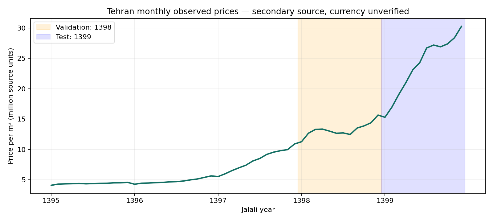
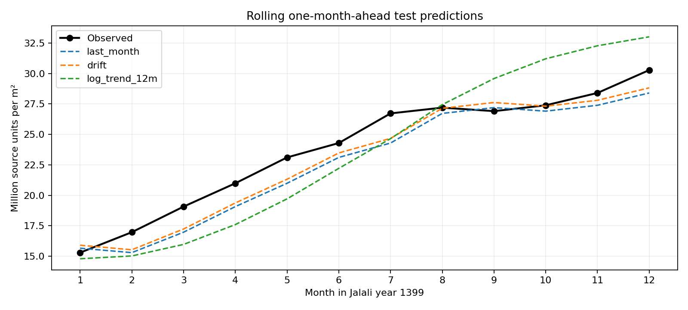
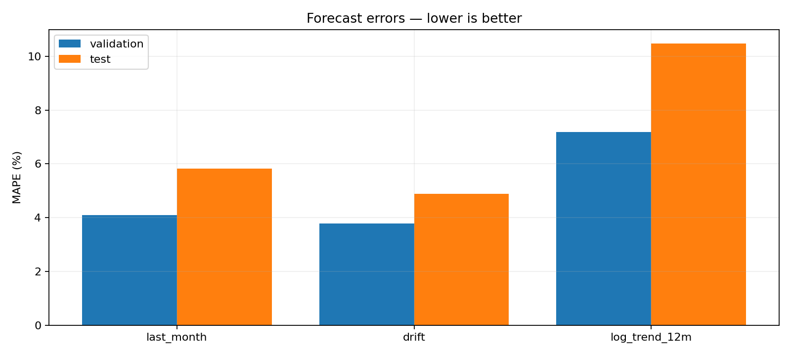

# دیتاست تاریخی پنج‌سالهٔ مسکن تهران و گزارش آزمون

تاریخ اجرای گزارش: **۲۰۲۶-۰۹-۱۲**

## خلاصه

- **۶۰ مشاهدهٔ ماهانهٔ منتشرشده**، از **فروردین ۱۳۹۵ تا اسفند ۱۳۹۹**: پنج سال کامل شمسی (تقریباً مارس ۲۰۱۶ تا مارس ۲۰۲۱)، نه پنج سال اخیر.
- داده مصنوعی تولید نشده، تاریخی به آگهی‌های بدون تاریخ نسبت داده نشده و هیچ ماهی با درون‌یابی پر نشده است.
- سطح داده: **میانگین قیمت هر مترمربع در کل شهر تهران**؛ نه ۶۰ معامله، نه دادهٔ منطقه‌ای و نه ویژگی‌های یک ملک.
- مدل انتخاب‌شده با MAE اعتبارسنجی: **drift**. در آزمون سال ۱۳۹۹، **MAPE = ۴٫۸۸٪** در برابر **۵٫۸۲٪** برای پیش‌بینی سادهٔ قیمت ماه قبل.
- این نتیجه فقط مربوط به پیش‌بینی یک ماه جلو روی همین سری تاریخی است؛ دقت API یا قیمت‌گذاری ملک منفرد را نشان نمی‌دهد.

## منبع و اعتبار داده

منبع ثانویهٔ عمومی:
[مخزن Regression_TheranHousing](https://github.com/amiralimadadi/Regression_TheranHousing).
نسخهٔ ثابت فایل:
[TehranHousingPriceBackground.csv](https://github.com/amiralimadadi/Regression_TheranHousing/blob/ac6a6406f2c5507ab9a905859efc1b61cb4d17c1/TehranHousingPriceBackground.csv).
[README همان نسخه](https://github.com/amiralimadadi/Regression_TheranHousing/blob/ac6a6406f2c5507ab9a905859efc1b61cb4d17c1/README.md)
پوشش ۱۳۹۵ تا ۱۳۹۹ را اعلام می‌کند؛ عنوان نمودار در
[Analysis.ipynb](https://github.com/amiralimadadi/Regression_TheranHousing/blob/ac6a6406f2c5507ab9a905859efc1b61cb4d17c1/Analysis.ipynb)
متغیر را `Average Price Per Meter in Tehran` معرفی می‌کند.

**محدودیت مهم:** دادهٔ منتشرشدهٔ تاریخی است، اما تطبیق تک‌تک مقادیر با گزارش‌های اولیهٔ رسمی انجام نشده است؛ آن را «دادهٔ رسمی تأییدشده» نمی‌نامیم. در فایل و توضیحات بررسی‌شده، واحد پول صریح نیست. بنابراین قیمت‌ها بدون تبدیل نگهداری شده‌اند و MAE/RMSE و نمودارها با **واحد منبع** گزارش می‌شوند، نه با ادعای قطعی ریال یا تومان. MAPE و R² به مقیاس پول وابسته نیستند.

مجوز صریح بازتوزیع دیتاست در منبع شناسایی نشد؛ مجوز کد این پروژه را به داده تعمیم ندهید و پیش از بازنشر یا استفادهٔ تجاری، وضعیت مجوز را با صاحب منبع بررسی کنید.

### فایل‌ها و قرارداد داده

- [source.csv](../../../data/external/tehran_monthly/source.csv): نسخهٔ دست‌نخوردهٔ ۶۰ ردیف منبع.
- [monthly.csv](../../../data/external/tehran_monthly/monthly.csv): دیتاست استانداردشده با منشأ هر ردیف.
- [metadata.json](../../../data/external/tehran_monthly/metadata.json): منشأ، نسخه، هش، بازه، تبدیل‌ها و محدودیت اعتبار/مجوز.
- [کد بازتولید](../../../src/tehran_house_price/data/historical.py): اعتبارسنجی، backtest و تولید نمودارها.

| ستون استاندارد | معنا |
|---|---|
| `month_jalali` | ماه شمسی به شکل YYYYMM؛ تاریخ میلادی نیست |
| `year_jalali` | سال شمسی |
| `month_of_year` | شمارهٔ ماه از ۱ تا ۱۲ |
| `price_per_m2_source_units` | قیمت هر مترمربع با عدد و واحد منبع، بدون تبدیل پول |
| `geography` | Tehran؛ کل شهر |
| `currency_status` | نامشخص بودن مستندات واحد پول |
| `source_url` | نشانی فایل در commit ثابت |

هش SHA-256 فایل خام:

```text
48e7d19787ea8738140c57df735aa18c0abdf3e0c6dd8b0d88f6ceb20355199b
```

کنترل کیفیت: ۶۰ ماه مرتب و یکتا، ۱۲ ماه در هر سال، بدون ماه گمشده، بدون قیمت تهی/نامتناهی/غیرمثبت. کنترل ساختاری، صحت اقتصادی ارقام را اثبات نمی‌کند.

## روش ارزیابی بدون نشت اطلاعات آینده

| بخش | بازهٔ شمسی | تعداد ماه |
|---|---|---:|
| تاریخچهٔ اولیه | ۱۳۹۵/۰۱ تا ۱۳۹۷/۱۲ | ۳۶ |
| اعتبارسنجی و انتخاب مدل | ۱۳۹۸/۰۱ تا ۱۳۹۸/۱۲ | ۱۲ |
| آزمون نهایی | ۱۳۹۹/۰۱ تا ۱۳۹۹/۱۲ | ۱۲ |

تقسیم تصادفی انجام نشده است. در هر ماه فقط مقادیر ماه‌های قبل قابل استفاده‌اند؛ پس از پیش‌بینی، مشاهدهٔ واقعی آن ماه برای پیش‌بینی ماه بعد به تاریخچه افزوده می‌شود. این **ارزیابی غلتان یک‌ماهه** است، نه پیش‌بینی یکجای ۱۲ ماه از ابتدای سال. فرض شده قیمت واقعی ماه قبل هنگام پیش‌بینی موجود است؛ تأخیر انتشار رسمی در این ارزیابی مدل نشده است.

سه روش با مشخصات ثابت و بدون جست‌وجوی ابرپارامتر:

1. `last_month`: قیمت آخرین ماه مشاهده‌شده؛ خط مبنای ضروری.
2. `drift`: آخرین قیمت + متوسط تغییر ماهانه از ابتدای تاریخچه تا ماه قبل؛ از کل تاریخچهٔ در دسترس استفاده می‌کند.
3. `log_trend_12m`: برازش خطی لگاریتم قیمت بر زمان در آخرین ۱۲ ماه و برون‌یابی یک ماه جلو؛ پنجرهٔ ۱۲ ماه از قبل ثابت است.

انتخاب مدل فقط بر اساس MAE در ۱۳۹۸ انجام می‌شود و برای ۱۳۹۹ تغییر نمی‌کند. امتیاز هر سه روش در آزمون صرفاً جهت مقایسه نمایش داده شده است. محاسبهٔ معیارها از تابع موجود پروژه، `compute_global_metrics`، استفاده می‌کند.

## نتایج واقعی اجرا

MAE و RMSE در واحد خام منبع به‌ازای مترمربع‌اند. MAPE در جدول درصد است؛ در JSON به شکل نسبت ذخیره می‌شود.

| مرحله | مدل | MAE | RMSE | MAPE (%) | R² |
|---|---|---:|---:|---:|---:|
| validation | last_month | 552,390 | 701,952 | 4.10 | 0.551 |
| validation | drift | 505,882 | 612,351 | 3.78 | 0.658 |
| validation | log_trend_12m | 937,064 | 1,149,816 | 7.19 | -0.206 |
| test | last_month | 1,326,408 | 1,524,970 | 5.82 | 0.891 |
| test | drift | 1,087,877 | 1,274,913 | 4.88 | 0.924 |
| test | log_trend_12m | 2,485,806 | 2,731,671 | 10.47 | 0.649 |

مدل drift نسبت به خط مبنای ماه قبل، MAE آزمون را حدود **۱۸٪** کاهش داده است. روند لگاریتمی در این داده بهتر از خط مبنا نیست. با فقط ۱۲ ماه آزمون نمی‌توان برتری پایدار یا تعمیم به سال‌های بعد را نتیجه گرفت؛ آزمون معناداری آماری انجام نشده است.

### روند پنج‌ساله و مرزهای ارزیابی



### مقایسهٔ پیش‌بینی با مشاهده در سال آزمون



### خطای اعتبارسنجی و آزمون



دادهٔ پشت نتایج: [metrics.json](metrics.json)، [predictions.csv](predictions.csv)، [جدول معیارها](metrics_table.md). نمودارها از همین فایل داده و پیش‌بینی‌های محاسبه‌شده تولید می‌شوند، نه تصاویر تزئینی.

## آزمون‌های نرم‌افزاری

در محیط **Python 3.11.2 / Linux** اجرا شد. پروژه در `pyproject.toml` نسخهٔ **Python 3.10** را هدف گرفته است؛ نتیجهٔ حاضر تأیید اجرای محلی در ۳٫۱۱ است، نه ادعای اجرای CI در ۳٫۱۰. برای بازتولید استاندارد پروژه، Python 3.10 توصیه می‌شود. برای اجرای محلی از `PYTHONPATH=src` استفاده شد و محدودیت نسخهٔ بسته تغییر نکرد.

| بررسی | نتیجه |
|---|---|
| تست‌های دیتاست جدید + معیارهای موجود | **۲۷ passed**، ۱ warning |
| کل مجموعهٔ پروژه | **۲۱۶ passed، ۱۰ skipped**، ۲۸ warnings |
| پوشش کل کد | **۸۱٪** |
| Ruff و Black فایل‌های پایتون جدید | موفق |
| اجرای کامل تولید CSV، معیارها و سه نمودار | موفق |

۱۲ تست جدید شامل پوشش پنج‌ساله، هش منبع، دادهٔ خراب، فرمول پیش‌بینی، ترتیب زمانی، عدم اثر آینده بر پیش‌بینی گذشته/انتخاب مدل و تکرارپذیری هستند. تست‌های skipشده به نبود مدل واقعی ذخیره‌شده یا parquet پردازش‌شده مربوط‌اند؛ آن‌ها را موفق محسوب نکرده‌ایم. هشدارها در لاگ کامل باقی مانده‌اند.

- [لاگ کامل تست‌ها و پوشش](full-tests.txt)
- [لاگ تست‌های متمرکز](focused-tests.txt)
- [نسخهٔ بسته‌های محیط اجرا](environment.txt)

## بازتولید

از ریشهٔ ریپازیتوری، بدون نیاز به دانلود داده یا دسترسی به Kaggle:

```bash
python3.10 -m venv .venv
source .venv/bin/activate
pip install -r requirements-research.txt
PYTHONPATH=src python -m tehran_house_price.data.historical
```

این دستور فایل استاندارد، `metrics.json`، `predictions.csv`، `metrics_table.md` و سه PNG را بازتولید می‌کند. گزارش متنی حاضر شرح ثبت‌شدهٔ همین اجراست. اعداد بدون seed تصادفی قابل‌بازتولیدند؛ هیچ مرحلهٔ تصادفی وجود ندارد.

برای اجرای تست‌ها، وابستگی‌های کامل لازم‌اند، چون پکیج تست‌های واحد موجود، API را نیز import می‌کند:

```bash
pip install -r requirements.txt pytest==8.2.2 pytest-cov==5.0.0
PYTHONPATH=src pytest tests/unit/test_historical.py tests/unit/test_evaluation.py -o addopts='-ra --strict-markers' -q
PYTHONPATH=src pytest tests/ -o addopts='-ra --strict-markers' -q --cov=src/tehran_house_price --cov-report=term
```

بازیابی اختیاری نسخهٔ خام از GitHub (برای اجرای روزمره لازم نیست):

```bash
gh api 'repos/amiralimadadi/Regression_TheranHousing/contents/TehranHousingPriceBackground.csv?ref=ac6a6406f2c5507ab9a905859efc1b61cb4d17c1' --jq .content | base64 -d > /tmp/tehran-source.csv
sha256sum /tmp/tehran-source.csv
```

## نسبت با مدل اصلی پروژه

این سری زمانی عمداً از `HouseListingSchema` و مسیر تولید مدل/API جداست: فاقد متراژ، اتاق، محله، پارکینگ و مشخصات ملک است. نمی‌توان آن را با ساخت این ویژگی‌ها به دیتاست معاملات تبدیل کرد. هیچ مدل تولیدی یا artifact سرویس جایگزین نشده است. برای ارزیابی پنج‌سالهٔ مدل قیمت‌گذاری **ملک منفرد** همچنان به دادهٔ واقعی تاریخ‌دار در سطح ملک با مجوز روشن، واحد پول مشخص و منشأ معتبر نیاز است.
