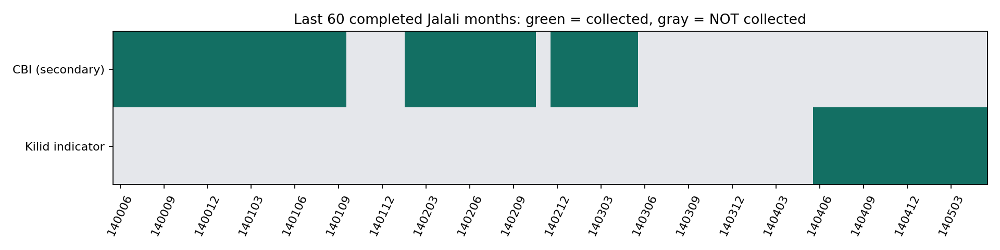
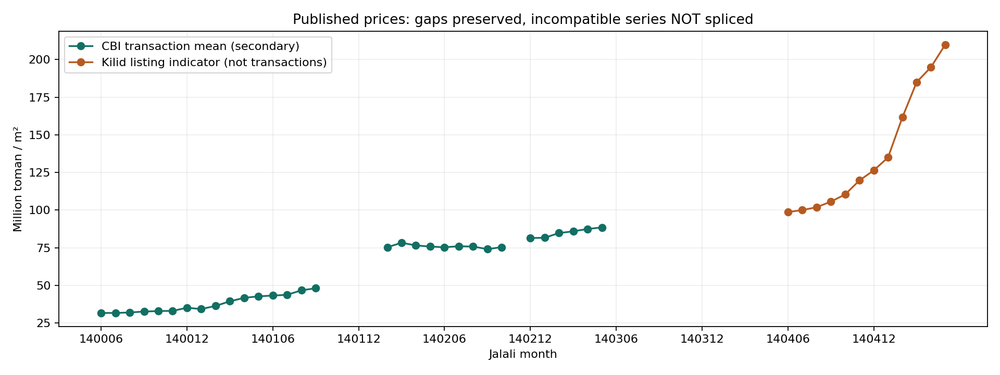
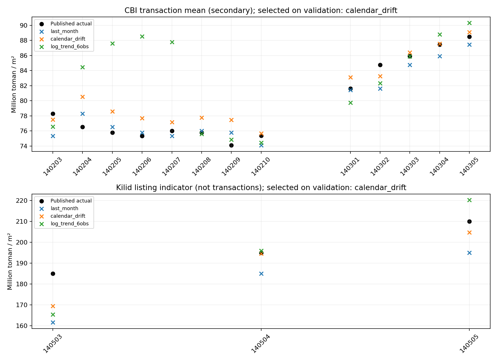

# گردآوری پنج سال اخیر و آزمون روی داده‌های جدید تهران

**تاریخ بررسی و اجرا: ۱۲ سپتامبر ۲۰۲۶ — وضعیت: گردآوری جزئی؛ دیتاست کامل پنج‌سالهٔ معاملات به دست نیامد.**

> این گزارش جایگزین ادعای «پنج سال اخیر» برای گزارش قبلی است. دادهٔ ۱۳۹۵–۱۳۹۹ مربوط به گذشته بود؛ هیچ‌کدام از ارقام آن برای پرکردن این گزارش استفاده نشده‌اند.

## دقیقاً چه چیزی جمع شد؟

برای دادهٔ ماهانه، **۶۰ ماه کامل اخیر شمسی: شهریور ۱۴۰۰ تا مرداد ۱۴۰۵** انتخاب شد. شهریور ۱۴۰۵ در تاریخ اجرا هنوز تمام نشده است. این پنجره با مرز ماه شمسی همتراز است، نه بازهٔ روزانهٔ دقیق ۲۰۲۱-۰۹-۱۲ تا ۲۰۲۶-۰۹-۱۲؛ ماه آغازین بخشی پیش از آن روز را نیز در بر می‌گیرد.

| دسته | تعداد مشاهده | بازهٔ بازیابی‌شده | ماه فاقد داده در پنجرهٔ ۶۰ماهه |
|---|---:|---|---:|
| میانگین معاملات بانک مرکزی، از منابع ثانویه | **۳۱** | ۱۴۰۰/۰۶ تا ۱۴۰۳/۰۵، با حفره | **۲۹** |
| شاخص قیمت منتشرشدهٔ کیلید، مرتبط با بازار آگهی | **۱۲** | ۱۴۰۴/۰۶ تا ۱۴۰۵/۰۵ | **۴۸** |
| ماه‌هایی با دست‌کم یکی از این دو معیار | **۴۳ از ۶۰** | پوشش فهرست منابع، نه یک سری همگن | **۱۷** |

**۴۳ عدد از منابع منتشرشده استخراج شده؛ نه ۴۳ معاملهٔ منفرد و نه ۶۰ ماه کامل.** این دو معیار را به یک سری مصنوعی نچسبانده‌ایم. برای ۱۷ ماه هیچ مقدار پذیرفته‌شده‌ای در این دو دسته نداریم؛ عدد صفر، قیمت ماه قبل یا درون‌یابی به جای آن‌ها ثبت نشده است.

ماه‌های فاقد هر دو نوع داده: **۱۴۰۱/۱۰–۱۲، ۱۴۰۲/۰۱، ۱۴۰۲/۱۱، ۱۴۰۳/۰۶–۱۲ و ۱۴۰۴/۰۱–۰۵**. «جمع نشده» به معنای اثبات عدم وجود داده در همهٔ منابع نیست.



## فایل داده، منبع و کیفیت

- **[CSV قابل استفاده](observations.csv)**: قیمت هر مترمربع به تومان، نوع سری، مقدار/واحد خام، منبع هر ردیف و شاهد استخراج.
- **[استخراج اولیهٔ JSON](../../../data/external/tehran_recent/observations.json)**: کاتالوگ منابع و ۴۳ رکورد دستی؛ ورودی ثابت بازتولید.
- **[ردیف‌های خام منتخب دقیقه](../../../data/external/tehran_recent/dlearn_city_extract.csv)** و **[هش فایل‌ها](../../../data/external/tehran_recent/manifest.json)**.
- **[جدول کامل پوشش](coverage.csv)**: ۱۲۰ خانهٔ «۲ سری × ۶۰ ماه»؛ مقادیر گمشده خالی‌اند.
- **[منابع و یادداشت‌های استخراج](sources.md)** و **[گزارش موانع، منابع بررسی‌شده و اعداد ردشده](collection-log.md)**.

گردآوری با جست‌وجو و بازیابی صفحات عمومی و **استخراج دستی حقایق** انجام شد. کد موجود، بازتولید آفلاین دادهٔ استاندارد و آزمون است، نه ادعای وجود اسکرپر خودکار موفق برای تمام منابع. فایل‌های هش‌دار، درستی فایل را کنترل می‌کنند؛ صحت اقتصادی عدد را اثبات نمی‌کنند. مجوز یکسانی برای همهٔ منابع ادعا نشده است؛ پیش از استفادهٔ تجاری، شرایط صاحبان داده بررسی شود.

### واحد پول و خطاهای منبع

- `million_irr × 100,000 = toman`؛ `million_toman × 1,000,000 = toman`.
- در CSV دقیقه، مقیاس ارقام از مرداد ۱۴۰۱ تغییر می‌کند؛ مقدار `427299` برای آن ماه با **اصلاح صریح ×۱۰۰** به `42,729,900` تومان تبدیل شد. مقیاس قبل/بعد با بازنشر گزارش بانک مرکزی برای شهریور ۱۴۰۰ و آبان ۱۴۰۱ تطبیق تقریبی دارد؛ تمام رقم‌های همهٔ ماه‌ها مستقلاً تأیید نشده‌اند. هر ۱۶ ردیف این منبع برچسب **`scale_inferred_crosschecked`** دارد تا استنباط تحلیلگر پنهان نشود.
- مهر ۱۴۰۲ در منبع حدود ۷۶ میلیون تومان است؛ دقت بیشتر جعل نشده و برچسب گردشدگی دارد.
- برخی صفحات بین متن و جدول تناقض دارند؛ فقط ارقام مشخص و قابل انتساب انتخاب شدند. جزئیات تصمیم‌ها در گزارش گردآوری آمده است.
- کیلید در صفحهٔ فعلی قیمت آگهی و قیمت تخمینی واحد متوسط را نشان می‌دهد. روش کامل ساخت/بازنگری تاریخچه روشن نیست؛ آن را **شاخص منتشرشدهٔ پلتفرم** می‌نامیم، نه معاملات قطعی یا دادهٔ مستقل تأییدشده. اختلاف کارت رشد ماهانه با جدول نیز حل نشده است.



## آزمون اجراشده

سه روش ثابت، **جداگانه برای هر سری**:

1. `last_month`: مقدار ماه قبل؛ خط مبنا.
2. `calendar_drift`: مقدار آخر + تغییر از اولین مشاهده تا آخرین مشاهده تقسیم بر **تعداد واقعی ماه‌های گذشته**.
3. `log_trend_6obs`: برازش خطی لگاریتم قیمت روی زمان در شش مشاهدهٔ قبلی؛ فاصلهٔ واقعی ماه‌های گمشده حفظ می‌شود.

شش مشاهدهٔ اول هر سری فقط برای شروع تاریخچه‌اند. انتخاب روش با **MAE اعتبارسنجی** انجام می‌شود؛ امتیاز آزمون در انتخاب دخالت ندارد. در هر گام فقط قیمت‌های ماه‌های قبل دیده می‌شوند. اگر خود ماه هدف یا ماه بلافاصله قبل آن گمشده باشد، پیش‌بینی یک‌ماهه امتیاز نمی‌گیرد؛ [وضعیت تک‌تک مشاهدات](evaluation_eligibility.csv) ثبت شده است.

| سری | اعتبارسنجی | آزمون | تعداد هدف آزمون |
|---|---|---|---:|
| معاملاتِ بازنشرشده | اسفند ۱۴۰۰ تا آذر ۱۴۰۱؛ ۱۰ هدف | مرز آزمون فروردین ۱۴۰۲؛ اهداف واجد شرایط خرداد ۱۴۰۲ تا مرداد ۱۴۰۳ | **۱۳** |
| شاخص کیلید | اسفند ۱۴۰۴ تا اردیبهشت ۱۴۰۵؛ ۳ هدف | خرداد، تیر و مرداد ۱۴۰۵ | **۳** |

این **بازآزمایی گذشته‌نگر با نسخهٔ فعلی داده** است، نه شبیه‌سازی عملیاتی کامل: تأخیر انتشار، اصلاحات بعدی منابع، و دسترس‌پذیری هر عدد در زمان تاریخی کنترل نشده‌اند. طرح ارزیابی پس از بررسی منابع مشخص شد و آزمایش پیش‌ثبت‌شده نیست. میانگین شهر نیز با تغییر ترکیب املاک معامله‌شده تغییر می‌کند؛ شاخص قیمت یک ملک ثابت نیست.

### خلاصهٔ نتیجه

| سری | روش منتخب اعتبارسنجی | MAPE آزمون منتخب | MAPE خط مبنا | نتیجه |
|---|---|---:|---:|---|
| معاملاتِ بازنشرشده | calendar_drift | **۲٫۰۸٪** | **۱٫۶۲٪** | مدل منتخب از خط مبنا بدتر شد؛ پنهان نشده است |
| شاخص کیلید تا مرداد ۱۴۰۵ | calendar_drift | **۳٫۷۲٪** | **۸٫۳۱٪** | خطای کمتر، اما فقط روی ۳ ماه؛ برای نتیجه‌گیری عمومی کافی نیست |

نمی‌توان از این آزمون، «دقت مدل در پنج سال اخیر» یا برتری پایدار استخراج کرد. آزمون کامل پنج‌ساله با دادهٔ کامل در این اجرا انجام نشده است. عدد کوچک MAPE در سری هموارِ شهر، به معنای همین خطا در قیمت‌گذاری خانه‌های منفرد نیست.



### تمام معیارها

قیمت‌ها و MAE/RMSE بر حسب **تومان به‌ازای مترمربع** هستند. MAPE در جدول درصد و در JSON نسبت است.

| Series | Split | Model | n | MAE (toman/m²) | RMSE | MAPE (%) | R² |
|---|---|---|---:|---:|---:|---:|---:|
| cbi_transaction_mean | validation | last_month | 10 | 1,671,210 | 1,903,314 | 4.12 | 0.821 |
| cbi_transaction_mean | validation | calendar_drift | 10 | 1,218,159 | 1,454,328 | 3.10 | 0.895 |
| cbi_transaction_mean | validation | log_trend_6obs | 10 | 1,433,655 | 1,749,523 | 3.55 | 0.849 |
| cbi_transaction_mean | test | last_month | 13 | 1,299,231 | 1,577,888 | 1.62 | 0.902 |
| cbi_transaction_mean | test | calendar_drift | 13 | 1,608,066 | 1,994,787 | 2.08 | 0.844 |
| cbi_transaction_mean | test | log_trend_6obs | 13 | 4,292,775 | 6,408,613 | 5.57 | -0.613 |
| kilid_listing_indicator | validation | last_month | 3 | 13,966,667 | 16,597,289 | 9.38 | -0.227 |
| kilid_listing_indicator | validation | calendar_drift | 3 | 9,299,206 | 12,658,180 | 6.06 | 0.286 |
| kilid_listing_indicator | validation | log_trend_6obs | 3 | 9,961,791 | 12,102,066 | 6.68 | 0.348 |
| kilid_listing_indicator | test | last_month | 3 | 16,133,333 | 17,054,423 | 8.31 | -1.755 |
| kilid_listing_indicator | test | calendar_drift | 3 | 7,106,204 | 9,494,206 | 3.72 | 0.146 |
| kilid_listing_indicator | test | log_trend_6obs | 3 | 10,242,887 | 12,760,784 | 5.31 | -0.543 |

خروجی محاسبات: [metrics.json](metrics.json)، [predictions.csv](predictions.csv)، [metrics_table.md](metrics_table.md). هیچ امتیاز مشترکی برای مخلوط دو سری محاسبه نشده است.

## تست‌های نرم‌افزاری

اجرا در **Linux / Python 3.11.2**، با `PYTHONPATH=src`. نسخهٔ هدف بسته در پروژه همچنان **۳٫۱۰** است و تغییر نکرده؛ نتیجهٔ محلی را به اجرای CI در ۳٫۱۰ تعمیم نمی‌دهیم.

| بررسی | نتیجهٔ ثبت‌شده |
|---|---|
| تست‌های جدید این بخش | **۱۹ passed**، ۱۵ warning |
| کل پروژه | **۲۳۵ passed، ۱۰ skipped**، ۴۲ warnings |
| پوشش کل کد | **۸۲٪** |
| Ruff و Black دو فایل پایتون جدید | موفق |
| آزمون یکپارچهٔ ساخت CSV، معیارها و PNG | موفق؛ بازتولید دوباره، بایت‌های یکسان در همین محیط |

تست‌های جدید شامل صحت تقویم، پوشش ناقص، تبدیل واحد، هش، دادهٔ خراب، جلوگیری از مخلوط معیارها، عدم فشرده‌سازی زمان در حفره‌ها، عدم اثر قیمت آینده بر پیش‌بینی گذشته/انتخاب روش و بازتولید کامل خروجی‌هاست. ده تست skipشده مربوط به نبود artifact واقعی مدل یا parquet هستند؛ موفق شمرده نشده‌اند. هشدارها عمدتاً از کتابخانه‌ها و در لاگ محفوظ‌اند.

[لاگ تست‌های جدید](focused-tests.txt) · [لاگ کامل و پوشش](full-tests.txt) · [نسخهٔ بسته‌ها](environment.txt)

## بازتولید آفلاین

از ریشهٔ ریپازیتوری:

```bash
python3.10 -m venv .venv
source .venv/bin/activate
pip install -r requirements-research.txt
PYTHONPATH=src python -m tehran_house_price.data.recent
```

برای خروجی در مسیر دیگر:

```bash
PYTHONPATH=src python -m tehran_house_price.data.recent --output-dir /tmp/tehran-recent-report
```

این دستور فایل‌های محاسباتی و سه نمودار را تولید می‌کند. README و گزارش تصمیم‌های گردآوری، شرح ثبت‌شدهٔ اجرای حاضرند. فایل ورودی با هش ثابت بررسی می‌شود و هیچ درخواست شبکه‌ای هنگام بازتولید لازم نیست.

برای تست‌ها پس از نصب وابستگی‌های پژوهش:

```bash
pip install -r requirements.txt pytest==8.2.2 pytest-cov==5.0.0
PYTHONPATH=src pytest tests/unit/test_recent.py -o addopts='-ra --strict-markers' -q
PYTHONPATH=src pytest tests/ -o addopts='-ra --strict-markers' -q --cov=src/tehran_house_price --cov-report=term
```

## چه چیزی هنوز لازم است؟

برای انجام **کامل** خواستهٔ پنج‌ساله، هنوز باید حفره‌های یک سری همگن با دادهٔ واقعی تاریخ‌دار و واحد/روش مشخص پر شوند. آرشیو مجاز سامانهٔ معاملات یا آرشیو تاریخ‌دار یک پلتفرم می‌تواند این نیاز را رفع کند؛ افزایش صرف تعداد ردیف با آگهی‌های امروز آن را رفع نمی‌کند.

همچنین مدل/API اصلی پروژه ویژگی‌های ملک منفرد می‌خواهد؛ این دادهٔ تجمیعی فاقد آن‌هاست. بنابراین مدل تولیدی دست‌کاری نشده و ادعای تست مدل ملک روی پنج سال معاملهٔ منفرد نداریم. کد ارزیابی این بخش از تابع معیارهای مشترک پروژه استفاده می‌کند.
